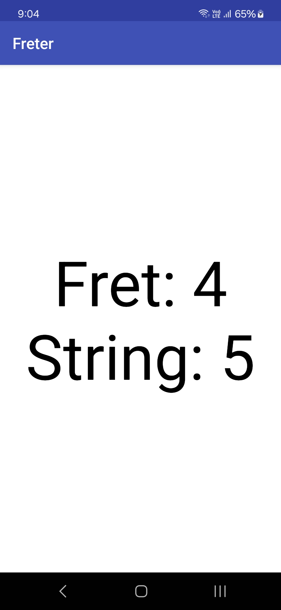
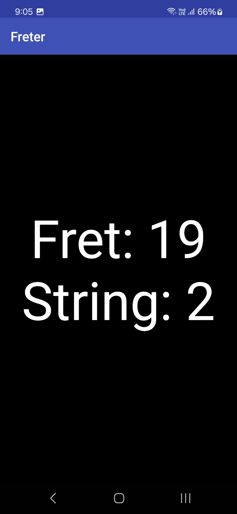

# Freter
(Sep 2018)

I made this application when a friend of mine was learning guitar. She wanted to practice and memorize fret locations on the guitar without looking. 

The application shows a random combination of Fret and String and waits for some time before changing to the next combination. Every time the combination changes, the screen inverts its colors to signal the change.

The user needs to look at the application screen and play the fret and string shown. As one repeats this exercise, they will learn to play combinations without the need to look at the guitar.

